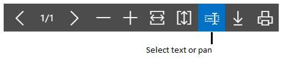

# Working with ReportsWorking with Reports
A report gathers information based on a specified set of criteria, and organises and presents the information in an easy-to-read, printable format.A report gathers information based on a specified set of criteria, and organizes and presents the information in an easy-to-read, printable format. There are many reports that you can access throughout the application.There are many reports that you can access throughout the application. The reports typically provide information relative to the context of the page you are on.The reports typically provide information relative to the context of the page you are on. For example, the **Customer** page includes reports for the top 10 customers and the sales statistics, and more.For example, the **Customer** page includes reports for the top 10 customers and the sales statistics, and more.

You can find reports in the **Reports** tab on selected pages, or you can use search to find reports by name.You can find reports in the **Reports** tab on selected pages, or you can use search to find reports by name. When you open a report, you are presented with a page that let's you specify information (options and filters) that determines want to include in the report.When you open a report, you are presented with a page that let's you specify information (options and filters) that determines want to include in the report. For example, depending on the report, you can specify a date range, a specific record such as a customer, or sorting order.For example, depending on the report, you can specify a date range, a specific record such as a customer, or sorting order.

## Previewing a reportPreviewing a report
Choose **Preview** to see the report in the Internet browser.Choose **Preview** to see the report in the Internet browser. Point to an area of the report to show the menu bar.Point to an area of the report to show the menu bar.  

..

Use the menu bar to:Use the menu bar to:

-   Move through pagesMove through pages
-   Zoom in and outZoom in and out
-   Resize to fit the windowResize to fit the window
-   Select textSelect text

    You can copy text from a report, and then paste it somewhere else, like a page in [!INCLUDE[d365fin](includes/d365fin_md.md)] or Microsoft Word.You can copy text from a report, and then paste it somewhere else, like a page in [!INCLUDE[d365fin](includes/d365fin_md.md)] or Microsoft Word.  Using a mouse, for example, you press and hold where you want to start, and then move the mouse to select one or more words, sentences, or paragraphs.Using a mouse, for example, you press and hold where you want to start, and then move the mouse to select one or more words, sentences, or paragraphs. You can then press the right mouse button, and select **Copy**.You can then press the right mouse button, and select **Copy**. You can the paste the selected text where ever you want it.You can the paste the selected text where ever you want it.
-   Pan the documentPan the document

    You can move the visible area of the report in any direction so you can view other areas or the report.You can move the visible area of the report in any direction so you can view other areas or the report. This is helpful when you have zoomed in to see details.This is helpful when you have zoomed in to see details.  Using your mouse, for example, press and hold the mouse button anywhere in the report preview, and then move your mouse.Using your mouse, for example, press and hold the mouse button anywhere in the report preview, and then move your mouse.

-   Download to a PDF file on your computer or network.Download to a PDF file on your computer or network.

## Saving a ReportSaving a Report
You can save a report to a PDF document, Microsoft Word document, or Microsoft Excel document by choosing **Send to**, and then making your selection.You can save a report to a PDF document, Microsoft Word document, or Microsoft Excel document by choosing **Send to**, and then making your selection. 

##  Scheduling a Report to Run Scheduling a Report to Run
You can schedule a report to run at a specific date and time.You can schedule a report to run at a specific date and time. Scheduled reports are entered in the job queue and processed at the scheduled time, similar to other jobs.Scheduled reports are entered in the job queue and processed at the scheduled time, similar to other jobs. You can choose to save the processed report to a file, such as an Excel, Word, or PDF, print it to a selected printer, or process the report only.You can choose to save the processed report to a file, such as an Excel, Word, or PDF, print it to a selected printer, or process the report only. If you choose to save the report to a file, then the processed report is sent to the **Report Inbox** area on your Home page, where you can view it.If you choose to save the report to a file, then the processed report is sent to the **Report Inbox** area on your Home page, where you can view it.

You can schedule a report when you open a report.You can schedule a report when you open a report. You choose the **Schedule** action and then you enter information such as printer, and time and date.You choose the **Schedule** action and then you enter information such as printer, and time and date. The report is then added to the job queue and will be run at the specified time.The report is then added to the job queue and will be run at the specified time. When the report is processed, the item will be removed from the job queue.When the report is processed, the item will be removed from the job queue. If you saved the processed report to a file, it will be available in the **Report Inbox** area.If you saved the processed report to a file, it will be available in the **Report Inbox** area.

## Printing a ReportPrinting a Report
When you want to print a report you have to download the report as a PDF, Word, or Excel document first by choosing **Send to**.When you want to print a report you have to download the report as a PDF, Word, or Excel document first by choosing **Send to**. Now, you can either open the report document right-away and print it, or save it and print it later.Now, you can either open the report document right-away and print it, or save it and print it later.

## Using Saved SettingsUsing Saved Settings
A report can include one or more entries in the **Saved Settings** box.A report can include one or more entries in the **Saved Settings** box. *Saved settings* are basically a predefined group of options and filters that you can apply to the report before previewing or sending the report to a file.*Saved settings* are basically a predefined group of options and filters that you can apply to the report before previewing or sending the report to a file. Using saved settings is a fast and reliable way to consistently generate reports that contain the correct data.Using saved settings is a fast and reliable way to consistently generate reports that contain the correct data.

The saved settings entry called **Last used options and filters** is always available.The saved settings entry called **Last used options and filters** is always available. This entry sets the report to use options and filters that were used the last time you looked at the report.This entry sets the report to use options and filters that were used the last time you looked at the report.

>[!NOTE]
>As an administrator, you can create and manage the saved settings for reports for all users.As an administrator, you can create and manage the saved settings for reports for all users. For more information, see [Managing Saved Settings on Reports](reports-saving-reusing-settings.md).For more information, see [Managing Saved Settings on Reports](reports-saving-reusing-settings.md).

## Changing the layout and look of a reportChanging the layout and look of a report
A report layout controls what is shown on a report, how it is arranged, and how it is styled.A report layout controls what is shown on a report, how it is arranged, and how it is styled. If you want to switch to a different layout, see [How to: Change Which Layout is Currently Used on a Report](ui-how-change-layout-currently-used-report.md).If you want to switch to a different layout, see [How to: Change Which Layout is Currently Used on a Report](ui-how-change-layout-currently-used-report.md). Or, if you want to customise your own report layout, see [How to: Create and Modify a Custom Report Layout](ui-how-create-custom-report-layout.md).Or, if you want to customize your own report layout, see [How to: Create and Modify a Custom Report Layout](ui-how-create-custom-report-layout.md).

## See AlsoSee Also
[Specify Printer Selection for ReportsSpecify Printer Selection for Reports](ui-specify-printer-selection-reports.md)  
[Managing Report and Document LayoutsManaging Report and Document Layouts](ui-manage-report-layouts.md)  
[Working with [!INCLUDE[d365fin](includes/d365fin_md.md)]](ui-work-product.md)[Working with [!INCLUDE[d365fin](includes/d365fin_md.md)]](ui-work-product.md)

